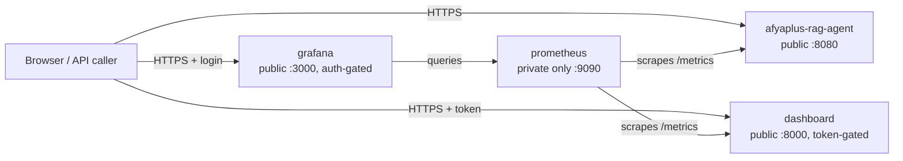

# Railway Deployment Guide — Executive Observability Stack

A complete, copy-paste reference for deploying and operating all four
Railway services this project runs: the chat API, the executive dashboard,
Prometheus, and Grafana. Written so a developer new to this repo can deploy
successfully without rediscovering the platform gotchas documented in
"Troubleshooting" below the hard way.

For the chat API's own Qdrant/Ollama Cloud configuration and general
production checklist, see [deployment.md](deployment.md) — this document
covers the four-service Railway setup specifically (SPEC-7.4).

## 1. What's deployed

| Service | Purpose | Public URL | Config file |
|---|---|---|---|
| `afyaplus-rag-agent` | Chat API (FastAPI + Chainlit + LangGraph) | Yes | `app/railway.json` |
| `dashboard` | Executive observability dashboard | Yes (token-gated) | `dashboard/railway.json` |
| `prometheus` | Metrics scraping/storage | No (private only) | `dashboard/railway/prometheus.railway.json` |
| `grafana` | Metrics visualization | Yes (auth-gated) | `dashboard/railway/grafana.railway.json` |

All four live in one Railway project (`afyaplus`, `production` environment)
and talk to each other over Railway's private network
(`<service-name>.railway.internal`), never the public internet:



Railway does **not** run `docker-compose.yml` directly — each service above
was created individually and given its own Dockerfile-based build config.
Local development still uses `docker-compose.yml` unchanged; see
[section 7](#7-running-everything-locally-instead).

## 2. Prerequisites

```powershell
# Install the Railway CLI (one of the following)
npm i -g @railway/cli
# or: scoop install railway
# or: iwr https://railway.app/install.ps1 | iex

railway login
```

`railway login` opens a browser for OAuth. This CLI session is **separate**
from any Railway MCP server connection Claude Code might have configured —
re-authenticating one does not re-authenticate the other. If an MCP-based
tool reports "Unauthorized" for Railway, reconnect it via `/mcp` inside
Claude Code specifically; running `railway login` in a terminal will not
fix it.

Link the CLI to this project once per machine:

```powershell
railway link -p a5fe5fb0-c562-455d-be97-99e4cf8fad9e -e f79ffd06-29d3-47d8-81ca-6efa9f7e16e5 -s afyaplus-rag-agent
```

(Omit `-s` and follow the interactive prompts if you'd rather pick the
service each time.) Confirm the link:

```powershell
railway status
```

## 3. Per-service environment variables

Set these via `railway variable set "KEY=value" --service <name>
--skip-deploys` (see [section 5](#5-the-deploy-recipe) for why
`--skip-deploys` and a deploy are separate steps). Values marked **secret**
must never be committed, logged, or printed to a terminal transcript —
generate them locally and paste directly into the command.

### `afyaplus-rag-agent` (chat API)

Full table already maintained in [deployment.md](deployment.md#railway-production-deployment)
and `railway.env.example` — do not duplicate it here; that is the source of
truth for this service's variables.

### `dashboard`

| Variable | Value | Secret? |
|---|---|---|
| `DASHBOARD_ACCESS_TOKEN` | random, 16+ chars | **yes** |
| `DASHBOARD_ARTIFACT_ROOT` | `/app` | no |
| `AFYAPLUS_HEALTH_URL` | `http://afyaplus-rag-agent.railway.internal:8080/health` | no |
| `DASHBOARD_HEALTH_TIMEOUT_SECONDS` | `3` | no |
| `PORT` | `8000` | no |

`PORT` here is not Railway's usual dynamic-assignment variable — it's set
explicitly because `dashboard/Dockerfile`'s `CMD` hardcodes `--port 8000`
rather than reading `$PORT`, and Railway needs to know that to health-check
correctly (see [Troubleshooting §3](#3-healthcheck-fails-with-service-unavailable-even-though-the-app-runs-fine)).

Generate the token safely (never type a real secret into a shared/loggable
shell history if you can avoid it):

```powershell
$env:DASHBOARD_ACCESS_TOKEN = -join ((48..57)+(65..90)+(97..122) | Get-Random -Count 24 | % {[char]$_})
railway variable set "DASHBOARD_ACCESS_TOKEN=$env:DASHBOARD_ACCESS_TOKEN" --service dashboard --skip-deploys
```

### `prometheus`

| Variable | Value | Secret? |
|---|---|---|
| `PORT` | `9090` | no |

No other application variables — its scrape targets
(`afyaplus-rag-agent.railway.internal:8080`, `dashboard.railway.internal:8000`)
are baked into the image at build time via
`dashboard/railway/prometheus.yml` (see [section 4](#4-if-you-need-to-change-a-scrape-target-or-provisioned-dashboard)
to change them).

### `grafana`

| Variable | Value | Secret? |
|---|---|---|
| `GRAFANA_ADMIN_USER` | `admin` (or your choice) | no |
| `GRAFANA_ADMIN_PASSWORD` | random, 16+ chars | **yes** |
| `GF_USERS_ALLOW_SIGN_UP` | `false` | no |
| `GF_AUTH_ANONYMOUS_ENABLED` | `false` | no |
| `GF_SECURITY_DISABLE_GRAVATAR` | `true` | no |
| `GF_ANALYTICS_REPORTING_ENABLED` | `false` | no |
| `PORT` | `3000` | no |

```powershell
$env:GRAFANA_ADMIN_PASSWORD = -join ((48..57)+(65..90)+(97..122) | Get-Random -Count 24 | % {[char]$_})
railway variable set "GRAFANA_ADMIN_PASSWORD=$env:GRAFANA_ADMIN_PASSWORD" --service grafana --skip-deploys
railway variable set "GRAFANA_ADMIN_USER=admin" --service grafana --skip-deploys
railway variable set "GF_USERS_ALLOW_SIGN_UP=false" --service grafana --skip-deploys
railway variable set "GF_AUTH_ANONYMOUS_ENABLED=false" --service grafana --skip-deploys
railway variable set "GF_SECURITY_DISABLE_GRAVATAR=true" --service grafana --skip-deploys
railway variable set "GF_ANALYTICS_REPORTING_ENABLED=false" --service grafana --skip-deploys
railway variable set "PORT=3000" --service grafana --skip-deploys
```

**Windows Git Bash users**: never set a variable whose value starts with a
single `/` (e.g. `/app`) from Git Bash without a `MSYS_NO_PATHCONV=1`
prefix — see [Troubleshooting §1](#1-a-path-like-variable-silently-gets-mangled-git-bash-only).
PowerShell does not have this problem.

## 4. Build configuration (one-time per service)

Each service needs to know which Dockerfile to build and where its
config-as-code file lives. **This cannot currently be set reliably from the
CLI** (see [Troubleshooting §5](#5-cli-config-edits-silently-do-nothing));
do it once in the Railway dashboard:

1. Open the service (`railway.app` → `afyaplus` project → the service tile).
2. **Settings** tab → scroll to **Config-as-code** → **Railway Config File**.
3. Enter the absolute repo path from the table below.
4. Save. No other Settings-page fields need touching — the config file
   controls builder, Dockerfile path, start command, and healthcheck all
   at once.

| Service | Railway Config File value |
|---|---|
| `afyaplus-rag-agent` | `/app/railway.json` |
| `dashboard` | `/dashboard/railway.json` |
| `prometheus` | `/dashboard/railway/prometheus.railway.json` |
| `grafana` | `/dashboard/railway/grafana.railway.json` |

### If you need to change a scrape target or provisioned dashboard

- **Prometheus scrape targets**: edit `dashboard/railway/prometheus.yml`
  (targets list at the bottom), then redeploy (§5). This file is *only*
  used for the Railway build — local Compose uses the separate
  `dashboard/prometheus.yml`, which points at Compose service names
  instead of `*.railway.internal` domains. Keep both in sync if you change
  scrape behavior.
- **Grafana's Prometheus datasource URL**: edit
  `dashboard/railway/datasources/prometheus.yml`. Same local/Railway split
  as above — local Compose provisions from `dashboard/grafana/provisioning/`.
- **Grafana dashboards**: edit files under
  `dashboard/grafana/dashboards/` — these *are* shared between local and
  Railway (the Railway Dockerfile `COPY`s them straight from that shared
  location), so one edit covers both.

## 5. The deploy recipe

**Always run these two commands together, in this order, for any of the
three Dockerfile-based services** (`dashboard`, `prometheus`, `grafana`):

```powershell
railway up --service <name> --detach
railway redeploy --service <name> --yes
```

Why both: `railway up` uploads your current code and starts a build, but it
resolves *build* settings (which Dockerfile, which builder) using Railway's
bare-root convention (`/railway.json` at the true repo root) — **not** the
per-service Config File path from §4 — regardless of what that field says.
`railway redeploy` re-triggers activation using the service's *actual*
stored settings, which correctly reads the per-service Config File. The
first `up` will very likely fail or build the wrong thing; that's expected.
The `redeploy` immediately after is what actually fixes it. See
[Troubleshooting §4](#4-a-fresh-railway-up-builds-the-wrong-thing-uses-the-wrong-dockerfile)
for the full explanation if you want to verify this yourself.

For `afyaplus-rag-agent`, a plain `railway up --service afyaplus-rag-agent
--detach` is sufficient — its config file already sits at the repo's
conventional root-adjacent location it's always used, so the first `up`
resolves correctly without needing a follow-up redeploy. Run one anyway if
you're ever unsure; it's a no-op-safe way to confirm.

### Watching a deploy to completion

`railway up`'s attached log stream can time out over slow connections. This
pattern avoids that and works reliably:

```powershell
railway up --service dashboard --detach --json
# note the deploymentId printed, then:
railway deployment list --service dashboard --json
# repeat until "status" is SUCCESS, FAILED, or CRASHED
```

To see *why* a deploy failed:

```powershell
# Build-time errors (compilation, missing files, bad Dockerfile):
railway logs --build <deploymentId> --service <name> --lines 60

# Runtime errors (app crashed after starting) — --latest is required,
# otherwise this silently shows the *previous successful* deploy's logs:
railway logs --service <name> --latest --lines 60
```

## 6. Troubleshooting

Every issue below was actually hit and fixed while first setting this up —
not hypothetical.

### 1. A path-like variable silently gets mangled (Git Bash only)

**Symptom**: the app crashes on startup with an error like
`DASHBOARD_ARTIFACT_ROOT does not exist: /app/C:/Program Files/Git/app`,
even though you set it to a plain `/app`.

**Cause**: Git Bash's MSYS layer auto-converts arguments that look like
Unix absolute paths into Windows paths *before* they reach `railway.exe`.

**Fix**: prefix the command with `MSYS_NO_PATHCONV=1`:

```bash
MSYS_NO_PATHCONV=1 railway variable set "DASHBOARD_ARTIFACT_ROOT=/app" --service dashboard --skip-deploys
```

Verify the raw stored value afterward:

```bash
railway variable list --service dashboard --kv 2>&1 | grep "^DASHBOARD_ARTIFACT_ROOT="
```

PowerShell doesn't have this problem — use it instead of Git Bash for any
`/`-leading value if you'd rather not think about this.

### 2. Deploy fails with "The executable `python` could not be found"

**Symptom**: build succeeds, deploy fails immediately; logs show Railway
trying to run a `python -m uvicorn ...` command inside a container that has
no Python at all (e.g. the Prometheus or Grafana base image).

**Cause**: the service's `deploy.startCommand` was left unset in its own
config-as-code file, so Railway silently fell back to a **stale value from
that service's own deploy history** (e.g. whatever the previous, wrongly-
configured deploy used) instead of the Docker image's own `ENTRYPOINT`/`CMD`.

**Fix**: always set `deploy.startCommand` explicitly in every service's
`*.railway.json`, matching that image's real entrypoint. Already done for
all three non-API services in this repo — `dashboard/railway.json` and
`dashboard/railway/{prometheus,grafana}.railway.json` each set it. If you
add a fourth service, don't skip this field even if "the image already has
a CMD" — Railway does not reliably fall back to it.

### 3. Healthcheck fails with "service unavailable" even though the app runs fine

**Symptom**: build and container start succeed, but the deploy sits
retrying a healthcheck for minutes and eventually fails, or logs show
requests never reaching the app.

**Cause**: Railway performs healthchecks (and its "is this port live"
liveness probe) against the `PORT` variable it expects your app to listen
on. If your Dockerfile hardcodes a fixed port instead of reading `$PORT`
(true for all three non-API services here — see their Dockerfiles), Railway
has no way to know which port to check unless told explicitly.

**Fix**: set a plain `PORT` variable on the service matching its actual
hardcoded port (`8000` for dashboard, `9090` for prometheus, `3000` for
grafana — see §3's tables). This is a real service variable, set with
`railway variable set`, not something in the config-as-code file.

### 4. A fresh `railway up` builds the wrong thing / uses the wrong Dockerfile

**Symptom**: you've correctly set a service's Railway Config File (§4) to
point at its own `*.railway.json`, but `railway up --service <name>`
still shows `builder: RAILPACK` in its deployment manifest, or builds using
a completely unrelated Dockerfile (in the worst case, an entirely different
service's app gets deployed under this service's name).

**Cause**: this is a genuine Railway CLI behavior, not a misconfiguration.
`railway up` resolves build settings using whatever bare `/railway.json` or
`/railway.toml` exists at the literal root of the directory you're
uploading from — by convention, ignoring each service's own configured
Config File path entirely. If another service's config happens to sit at
that bare root (as `afyaplus-rag-agent`'s originally did, before this repo
moved it to `app/railway.json` specifically to stop this), every other
service's `up` silently inherits it.

**Fix**: this is why §5's two-command recipe exists. `railway redeploy`
(not `up`) is the command that correctly re-resolves each service's own
Config File. Run `up` to push code, then always follow with `redeploy`
before trusting the result. Don't rely on `up`'s own reported status alone.

### 5. CLI config edits silently do nothing

**Symptom**: `railway environment edit --service-config <service> <dot.path>
<value> --json` returns `{"committed":false,"message":"No changes to
apply","staged":false}` — no error, but nothing actually changes, even for
values that are definitely different from the current state (tested on
plain variables too, not just build settings).

**Cause**: unclear — this command did not successfully apply any change in
this project's experience, on either brand-new or long-established
services, for both build-config and variable dot-paths.

**Fix**: don't use this command for anything that matters.
- For environment **variables**: use `railway variable set "KEY=value"
  --service <name>` (reliable, confirmed working throughout this setup).
- For **build/deploy config** (Dockerfile path, start command, healthcheck):
  use a config-as-code JSON file (§4) plus the Railway Config File field,
  set once via the dashboard UI.

### 6. `railway environment config --json` prints real secrets

**Symptom**: this command (useful for inspecting resolved build/deploy
settings across all services) also dumps every service's full variable
values in plaintext, including API keys and passwords.

**Fix**: never run it raw in a shared/logged terminal. Pipe it through a
filter that strips the `variables` key from each service before it's
displayed anywhere:

```powershell
railway environment config --json | python -c "
import json, sys
data = json.load(sys.stdin)
for svc in data.get('services', {}).values():
    svc.pop('variables', None)
print(json.dumps(data, indent=2))
"
```

(On Windows, `railway environment config --json` also prints a
non-JSON `Environment production` line first — the Python filter above
expects pure JSON on stdin, so in Git Bash pipe through
`sed -n '/^{/,$p'` first, or in PowerShell just capture and slice the
output starting from the first `{`.)

If you've already run the raw command and secrets ended up in a terminal
transcript, treat those specific keys as compromised and rotate them.

### 7. `railway login` doesn't fix an "Unauthorized" MCP tool

Covered in §2 — CLI auth and any Claude Code Railway MCP connection are
separate sessions. Reconnect the MCP server itself (`/mcp` inside Claude
Code) rather than re-running `railway login` in a terminal.

### 8. The external drive / local disk isn't a Railway issue at all

Not covered here — unrelated to Railway. If you hit disk-space problems
while working in this repo locally, that's an OS-level concern, not
something these services need.

## 7. Running everything locally instead

For local development, skip Railway entirely and use Docker Compose — it
mirrors the same four services but wires them together with Compose's own
DNS (`api`, `dashboard`, `prometheus`) instead of Railway's
`*.railway.internal`, so **the two setups use genuinely different config
files** (§4 above lists which files are Railway-only).

```powershell
$env:DASHBOARD_ACCESS_TOKEN = "any-string-16-chars-or-more"
$env:GRAFANA_ADMIN_PASSWORD = "any-string-16-chars-or-more"
docker compose up --build
```

| Service | Local URL |
|---|---|
| Chat API | http://localhost:8000 |
| Dashboard | http://localhost:8001/?access_token=`<token>` |
| Prometheus | http://localhost:9090 |
| Grafana | http://localhost:3000 (login: `admin` / your `GRAFANA_ADMIN_PASSWORD`) |

Compose reads the chat API's real Ollama Cloud/Qdrant credentials from the
gitignored root `.env` — it does not host or depend on a local Ollama
daemon. See [dashboard/README.md](../dashboard/README.md) for the
dashboard service's own local-only run mode (without the full stack) and
more detail on failure boundaries.

To run just the chat API locally without Docker at all (the original,
pre-SPEC-7.4 workflow), see the Quick Start section in the root
[README.md](../README.md).

## 8. Quick command reference

```powershell
# Auth & linking (once per machine)
railway login
railway link -p a5fe5fb0-c562-455d-be97-99e4cf8fad9e -e f79ffd06-29d3-47d8-81ca-6efa9f7e16e5

# Check what's currently live
railway status
railway deployment list --service <name> --json

# Set a variable (never for path-like values in Git Bash without the prefix — see §6.1)
railway variable set "KEY=value" --service <name> --skip-deploys

# List variable names only, without values (safe to run/share)
railway variable list --service <name> --kv 2>&1 | grep -oE "^[A-Z_]+="

# Deploy (Dockerfile-based services: dashboard, prometheus, grafana)
railway up --service <name> --detach
railway redeploy --service <name> --yes

# Deploy (afyaplus-rag-agent — single up is normally enough)
railway up --service afyaplus-rag-agent --detach

# Logs
railway logs --service <name> --latest --lines 60          # runtime, forces latest even if failed
railway logs --build <deploymentId> --service <name>        # build-time only

# Restart without a new build
railway redeploy --service <name> --yes
```
